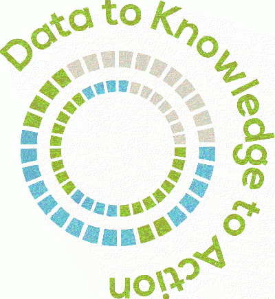

   

Living in a paradoxical age, as *John Naisbitt* puts it,
### We are drowning in data, but starved for knowledge.

Turning data to insights is probably the most prevalent challenge of the present age -- be it for individuals, businesses, or governments. Emergence of digital technologies made it unprecedentedly easy to collect data whereas the increase in computational power has been the greatest relief for handling massive data sets. What we are probably short of is the skills set to build state-of-the art models that can turn data to real wisdom.

QUANTURK's overarching goal is to put quantitative tools such as data analytics and machine intelligence to work for **predicting future** with highest possible accuracy. This can range from predicting financial markets for finding optimal investment opportunities that matches the desired risk/return profile or estimating the risk of retinal hemorrhage in a patient with diabetic retinopathy. 

#### Quantitative Finance for Professionals (QFP)

QFP as part of QUANTURK is a capacity building initiative and continuously updated training programme that is tailored to the everyday needs of finance professionals. It comprises several quantitative skills courses which are taught by qualified financial mathematicians in a simple language. QFP pursues a balance between theory and practice, and it aims to bridge the gap between finance practitioners and state-of-the-art quantitative finance tools. The Programme is envisioned to be a one-stop-shop for finance practitioners where they can acquire the most essential technical skills -- be it risk management, portfolio optimization, asset pricing or making predictions.

