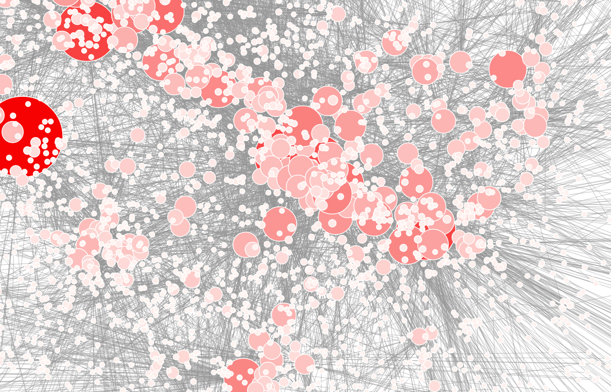

# I2DS
#### @Istinye University, Spring 2018/2019

The amount and complexity of information produced in science, engineering, business, and everyday human activity are increasing at a staggering rate. **The goal of this course is to expose you to methods and techniques for analyzing and understanding complex data.** Data Science lies at the intersection of statistics, computer science, and, of course, the domain from which the data comes from. This course will provide an introduction to the former two: statistics and computer science and provide you with a toolset to conquer problems in your domain!

**Instructor:** Dr. N. Serhan Aydin, Dept. of Industrial and Systems Engineering @ Istinye University

The course content is enriched with inputs from similar courses offered @ diffent instituions:

* ...
* ...

Stay tuned! Further course details will appear here soon.

