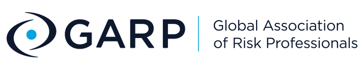
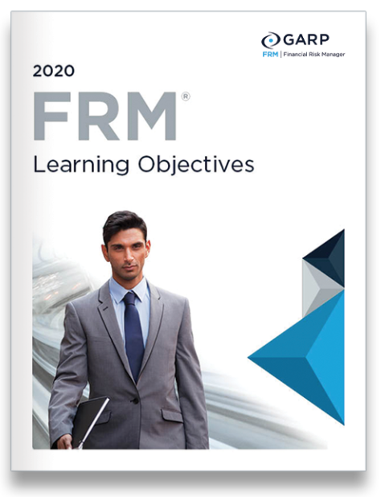
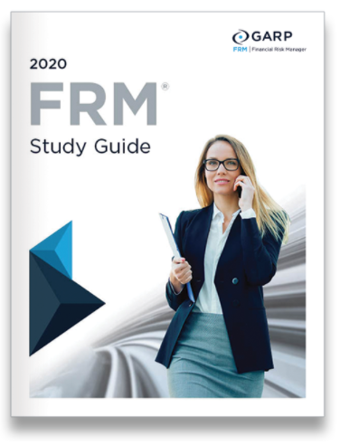
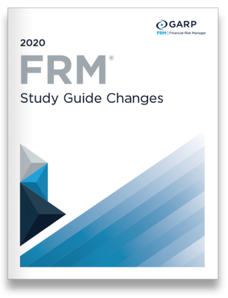

#### <a href="https://forms.gle/VsLxXkYJRd52pmqp8" target=www>>> If you're sitting for the upcoming FRM Exam, please click here!</a>

#### "As the financial industry becomes increasingly competitive, the professionals who succeed are the ones who can demonstrate their ability to add value to an organization."

Financial Risk Professional (FRM) is known as "The global standard for financial risk." It is is the leading certification for risk managers and consistently in demand by major financial institutions, as well as firms dealing with risk management, around the world. FRM is awarded only to professionals who demonstrate the knowledge and ability to anticipate, respond, and adapt to critical risk issues.

As the financial industry becomes increasingly competitive, the professionals who succeed are the ones who can demonstrate their ability to add value to an organization. Earning an FRM proves that your knowledge and skills are up to the latest international standards, and connects you to an elite network of expert risk professionals employed by the world’s leading institutions. For more information, visit [FRM Website](https://www.garp.org/#!/frm).

QUANTURK is one of the [Exam Prep Providers](https://www.garp.org/#!/frm/exam-preparation-providers) approved by GARP. 

"*GARP does not endorse, promote, review or warrant the accuracy of the products or services offered by QUANTURK of GARP Exam related information, nor does it endorse any pass rates that may be claimed by QUANTURK. Further, GARP is not responsible for any fees or costs paid by the user to QUANTURK nor is GARP responsible for any fees or costs of any person or entity providing any services to QUANTURK. ERP®, FRM®, GARP® and Global Association of Risk Professionals™, in standard character and/or stylized form, are trademarks owned by the Global Association of Risk Professionals, Inc.*"

#### Course Description
The course aims to help participants get prepared for the upcoming FRM Exam (Part I) as effectively as possible and pass it on their first attempt. The course will also seek to provide candidates a thorough hands-on guidance in their studies.

#### Program Structure
This is a 10-week course comprising weekly online classes that cover all FRM Exam (Part I) topics. The course will feature various active learning activities and practice/mock exams to improve the success rate. Weekly course load will be 4 to 8 hours depending on the candidate's background.

#### Learning Objectives and Study Guides

  

#### Teaching Method
The course will put more emphasis on quantitative parts of the exam which are more difficult to grasp with independent study. Textual parts will be covered through scheduled reading assignments and self-check quizzes.

* Asynchronous & Synchronous Sessions
* Slides, Handouts, Readings
* Quizzes & Problem Solving
* Interim Practice Exams

#### Pricing
Course fee is only **inclusive** of the class lectures, mock exams, and other handouts (if any). **Licensed exam study materials or real exam registration fees are not part of the course fee**. 

#### Returning Candidates
A candidate who fails the real exam may be allowed to re-sit the course for free given both his/her attendance in the course and average performance in the Interim Exams have been 80% or over.
 
<iframe src="https://calendar.google.com/calendar/b/1/embed?mode=AGENDA&amp;height=600&amp;wkst=2&amp;bgcolor=%23FFFFFF&amp;src=ugs8vuds3btmj0g13bhjospkc4%40group.calendar.google.com&amp;color=%23865A5A&amp;ctz=Europe%2FIstanbul" style="border-width:0" width="100%" height="300" frameborder="0" scrolling="no"></iframe>

